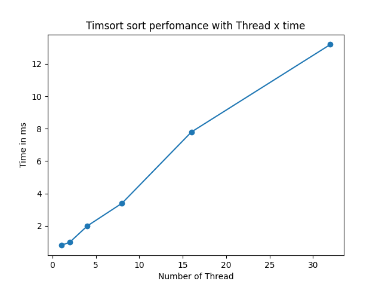
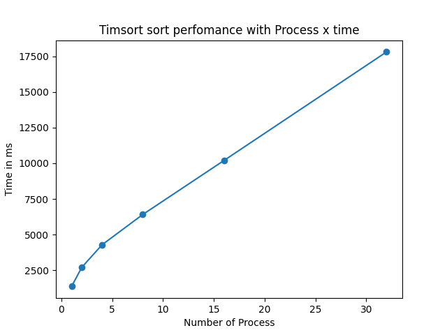
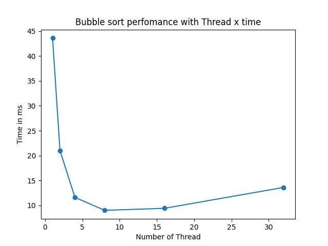

# Laboratório I – Paralelismo de Processos e Threads

O laboratório consiste em realizar um merge sort utilizando threads. O grupo é composto por Beatriz Maia, Iago Cerqueira e Sophie Dilhon.

## Configuração
O programa foi desenvolvido com a linguagem Python 3.10, utilizando pacotes da biblioteca padrão de python, pandas e matplotlib. Para configurar sua máquina, é necessário instalar as dependências utilizadas. Aconselha se a criação de um ambiente {ambiente} da seguinte forma:

```sh
python -m venv {ambiente}
```

no qual {ambiente} pode ser qualquer nome. Após a criação do ambiente, é necessário ativá-lo. Para ativar no linux ou mac, execute o seguinte comando:

```sh
source /{ambiente}/bin/activate
```

para ativar no windows, execute o seguinte comando:

```sh
.\{ambiente}\Scripts\activate
```

no qual {ambiente} deve ser substituído pelo nome do ambiente criado anteriormente. Após isso, instale as dependências utilizando

```sh
pip install -r requirements.txt
```

## Execução
O programa recebe dois argumentos como entrada, sendo eles uma quantidade **k** de threads que serão geradas inicialmente e um tamanho **n** do array.
Para executar o programa basta rodar o seguinte comando no terminal:

```sh
python main.py k n
```

## Desenvolvimento

A implementação pode ser dividida em três partes:

- Geração dos arrays
- Ordenação dos arrays iniciais
- *Merge* de arrays de forma ordenada

Para ambas etapas, foi testado tanto o uso de threads quanto o de processos. Para as threads, utilizou-se uma classe que herda a classe [Threads](https://docs.python.org/3/library/threading.html#thread-objects) do pacote threading. O seu propósito é para armazenamento do resultado de cada função executada nas threads.

Já para os processos também usou-se uma classe customizada, esta herda a classe Process do pacote [multiprocessing](https://docs.python.org/3/library/multiprocessing.html). E utiliza Queues para obter os resultados de cada processo. 


### Geração dos arrays

Esta etapa consiste na criação dos arrays de quantidade **n** e na divisão deles em **k** arrays. Como essa parte é o input para o algoritmo de *mergesort*, ela não é considerada na contabilização da duração do programa.

### Ordenação dos arrays iniciais

Essa etapa consiste na criação de **k** threads. As threads são primeiro criadas, para depois serem iniciadas. Cada uma delas é responsável por ordenar um trecho do vetor gerado. Dois algoritmos foram testados, sendo eles o _bubble sort_ e o Timsort (implementado pela função [_sorted_](https://docs.python.org/3/library/functions.html#sorted) do python).

### *Merge* de arrays de forma ordenada

Essa etapa consiste na junção dos arrays de forma ordenada. A junção dos vetores são feitas em pares, em que cada junção é feito por uma thread ou processo. Se há uma quantidade impar de vetores, o último vetor é deixado de lado até a última junção. 

Essa etapa é dividida da seguinte forma:
```python
# Merge arrays
while len(sorted_arrays) > 1:
    sorted_arrays = merge_arrays(sorted_arrays)
```
Desta forma, é feito a primeira junção e atribuido um nome aos novos vetores. Caso exista mais que 1 vetor, significa que ainda tem como fazer junção e o processo continua. 

## Análise
Os testes se iniciaram com o uso de Threads e a função sorted para a ordenação. Esperava-se que o tempo de execução diminuisse ao usar uma quantidade de threads entre 4 ou 8 (quantidade de cores do processador) e os arrays fossem muito grandes.

Foi feito testes com arrays variando de 100 até 1000000 (limite devido a tempo). Para questão da análise, vamos considerar um array de tamanho 1000.

No entanto, o resultado não foi o esperado, uma vez que o tempo não melhorava independente da quantidade de threads e tamanho de array. Abaixo o gráfico que mostra esse comportamento para um array de tamanho 1000.



Em seguida, foi feito o teste com o uso de processos. Esperava-se que o uso de processos aumenta-se o tempo em comparação com o uso de threads, uma vez que o custo de criar processos é maior que o custo de criar threads. De fato essa diferença foi notável nos resultados, além disso também houve melhora do tempo independente do número de processos e do tamanho do array. Abaixo o gráfico que mostra esse comportamento para um array de tamanho 1000.



Por fim, foi feito o teste utilizando threads e um algoritmo de ordenação menos eficiente que o Timsort ( O(nlg(n)) ), escolheu-se o Bubble Sort ( O(n²) ). Foi então possível notar uma melhora no tempo quando utilizados 4 e 8 threads, independente do tamanho do array. Abaixo o gráfico que mostra esse comportamento para um array de tamanho 1000.



Para ver a análise em vídeo, acesse [este link](https://youtu.be/9KBhEfurvQg).

## Referencias

https://docs.python.org/3/library/threading.html
https://docs.python.org/3/library/multiprocessing.html#multiprocessing.pool.ThreadPool +  https://stackoverflow.com/questions/69005467/how-to-get-return-values-of-multi-threads-once-one-of-them-is-finished
https://superfastpython.com/thread-return-values/#Need_to_Return_Values_From_a_Thread