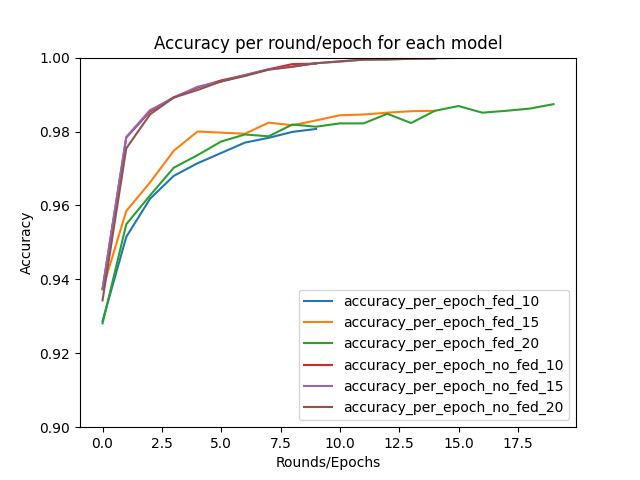
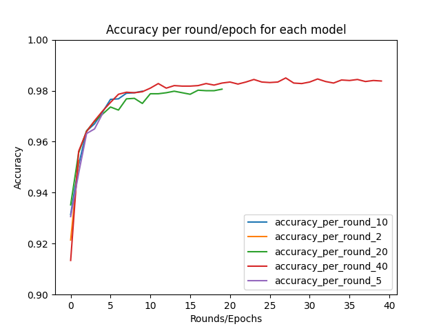

# Laboratório II – Aprendizado Federado

O laboratório consiste em aprender mais sobre aprendizado federado, comparado com aprendizado padrão e aprendendo sobre o pacote flwr. O grupo é composto por Beatriz Maia, Iago Cerqueira e Sophie Dilhon. Para ver a análise em vídeo, acesse [este link](https://youtu.be/YD3U71twAt0).


## Configuração
O programa foi desenvolvido com a linguagem Python 3.10, utilizando pacotes da biblioteca padrão de python, com enfâse em flwr e tensorflow. Para configurar sua máquina, é necessário instalar as dependências utilizadas. Aconselha se a criação de um ambiente {ambiente} da seguinte forma:

```sh
python -m venv {ambiente}
```

no qual {ambiente} pode ser qualquer nome. Após a criação do ambiente, é necessário ativá-lo. Para ativar no linux ou mac, execute o seguinte comando:

```sh
source /{ambiente}/bin/activate
```

para ativar no windows, execute o seguinte comando:

```sh
.\{ambiente}\Scripts\activate
```

no qual {ambiente} deve ser substituído pelo nome do ambiente criado anteriormente. Após isso, instale as dependências utilizando

```sh
pip install -r requirements.txt
```

Uma observação é que os requirements foram feitos utilizando o pip freeze em uma máquina com Windows então pode ocorrer alguns problemas na instalação com pacotes como tensorflow-intel==2.12.0. 

##  Atividade 1

Esta atividade foi feita para comparar o modelo treinado de forma tradicional para de forma federada. Para executar a atividade 1, basta rodar a script atv1_main.py. O código foi feito considerando como base o notebook fornecido pelo professor. 
Para a atividade, foi executado o FlowerClient com valores de round 10, 15 e 20 e o modelo tensorflow com épocas 10, 15 e 20.

### Análise

O uso de modelos e aprendizado federado teve um desempenho similar, mas não melhor ou igual ao do formato de treinamento tradicional, como observado no gráfico abaixo. Foi interessante observar como a partição dos dados e o treinamento de modelos diferentes, ainda foi capaz de resultar em um modelo final com um desempenho surpreendente (acima de 96%). É importante observar que a escala da imagem vai de 0.9 a 1.



O experimento consiste em treinar imagens MNIST, um dataset de imagens toy e bastante simples. Logo, seria ideal fazer este experimento com dados mais complexos e talvez até desbalanceado, para ver o comportamento do treinamento federado e aproximá-lo ao uso real. 


## Atividade 2

Nesta atividade, o código foi dividido em cliente e servidor para simular o comportamento de modelos de dispositivos diferentes. 

Primeiro, é necessário que existe o servidor. O servidor foi hospedado no endereço **localhost:8080**. Para inicializá-lo, é necessário estabelece a quantidade de rounds que será executada e a estratégia utilizada, como mostrada no notebook. O trecho abaixo mostra como inicializar o servidor.

```py
fl.server.start_server(server_address='localhost:8080',
                           config=fl.server.ServerConfig(num_rounds=round),
                            strategy=strategy)
```

Uma vez o servidor foi inicializado, o cliente (modelo local) pode ser inicializado cada um em seu terminal. O FlowerClient é do tipo NumpyClient e portanto, para inicializá-lo, basta utilizar o seghuinte método:

```py
fl.client.start_numpy_client(
            server_address="localhost:8080",
            client=flower_client_model())
```

A função **flower_client_model()** é a mesma utilizada na atividade 1, no qual é inicializado um client que treina utilizando os dados do MNIST.

Para questão de facilidade e limitação computacional do computador, foi escolhido que o mínimo de sampling possível seria 5 e que a quantidade mínima de modelos disponíveis seria 5.

### Análise

Para a atividade, foi treinado com rounds de 2, 5, 10, 20 e 40 e comparado o seu resultado. Na figura abaixo, é possível observar que o treinamento chega a se satura próximo de ~98%.



Enquanto o modelo com 40 rounds tem-se observado uma acurácia melhor, esse comportamento se mostra em rounds anteriores também. Ou seja, ter tido mais rounds não beneficiou o modelo, tendo um comportamento similar ao de 10 rounds. Isso provavelmente está relacionado ao fato que o dado trabalhado era bastante simples (MNIST).


## Referencias

https://flower.dev/docs/apiref-flwr.html#module-flwr.client